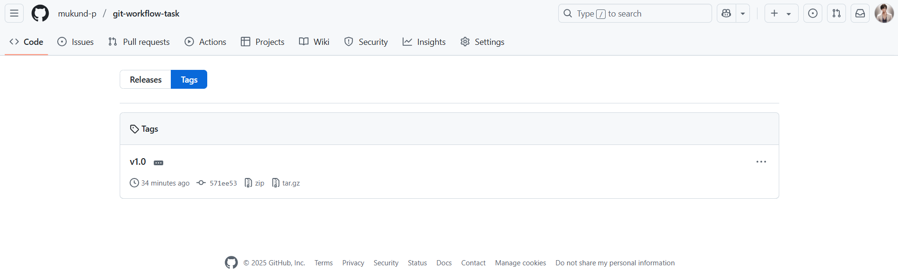

# DevOps Git Workflow Project
## Task-4
---

This project was created as part of the DevOps internship to demonstrate best practices in version control using Git and GitHub.

## Objective

Build a version-controlled project using Git and GitHub, following proper branching, pull request, and tagging workflows.

## Project Structure

├── screenshots/  
├── .gitignore  
├── README.md  
└── documentation.md  

## Files Included
- `README.md` – This file
- `.gitignore` – To exclude unnecessary files
- `documentation.md` – Markdown summary of the Git workflow
- Git tag: `v1.0`

## Branch Structure
- `main` – Final production-ready branch
- `dev` – Integration branch
- `feature` – Development branch where all tasks were performed initially

## Workflow Summary
1. Initialized a local Git repository and pushed to GitHub
2. Created `dev` and `feature` branches
3. Performed development in `feature` branch
4. Opened a PR from `feature` to `dev`, and then from `dev` to `main`
5. Added `.gitignore` and documented the process in `documentation.md`
6. Created a Git tag (`v1.0`) for versioning

##  Screenshots

### 1. Branch List :

### 2. Pull Request Page :

### 3. Git Tag List :

### 4. Git Log or Commit History :

---

## Outcome
This task helped understand Git branching, pull requests, tagging, and collaboration workflows using GitHub.

# 📘 Git Interview Questions and Answers

## 1. What is Git?
Git is a distributed version control system used to track changes in source code during software development. It enables multiple developers to work on a project simultaneously without interfering with each other’s work, supports non-linear development via branches, and maintains a complete history of changes.

## 2. What is the difference between merge and rebase?
- **Merge**: Combines the changes from one branch into another. It preserves the history of both branches and creates a new merge commit.
- **Rebase**: Re-applies commits from one branch onto another base tip, effectively rewriting history. It creates a linear history, which can be cleaner but should be used with caution on shared branches.

## 3. What is a pull request?
A pull request is a feature on platforms like GitHub that allows developers to notify team members that they have completed a feature or fix and would like it to be reviewed and merged into the main codebase. It facilitates code review, discussion, and integration of changes.

## 4. How do you resolve merge conflicts?
- Identify the files with conflicts during a merge.
- Open the conflicted files and manually choose or combine the desired changes.
- Mark the conflicts as resolved using `git add`.
- Complete the merge with `git commit`.

## 5. What are Git tags?
Tags are references in Git that point to specific points in history, typically used for marking release versions (e.g., v1.0, v2.0). Tags can be lightweight (just a name) or annotated (with metadata such as tagger name, date, and message).

## 6. What is Git workflow?
A Git workflow is a set of guidelines or strategies for using Git in a team. Common workflows include:
- **Feature Branch Workflow**
- **Git Flow Workflow**
- **Forking Workflow**
Each defines how branches are used, how changes are merged, and how releases are managed.

## 7. Explain git stash.
`git stash` temporarily shelves (or stashes) changes in the working directory so you can switch contexts and work on something else without committing unfinished work. You can reapply the stashed changes later with `git stash apply` or `git stash pop`.

## 8. What is the use of .gitignore?
The `.gitignore` file specifies intentionally untracked files that Git should ignore. For example, it can exclude log files, build artifacts, or environment-specific files that should not be committed to the repository.
